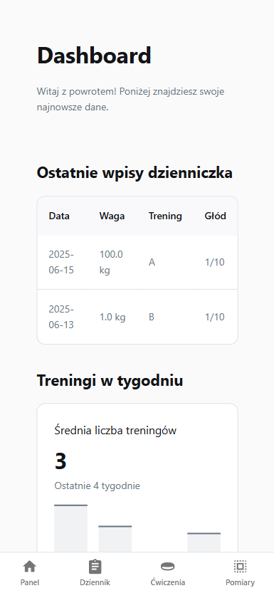
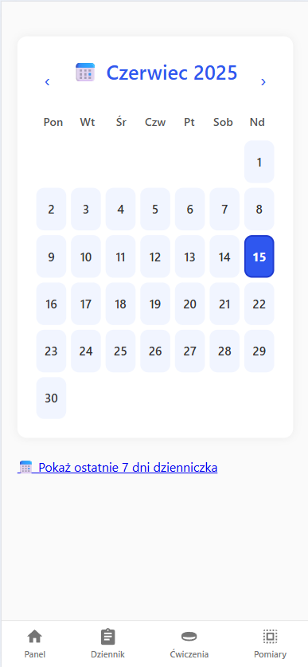
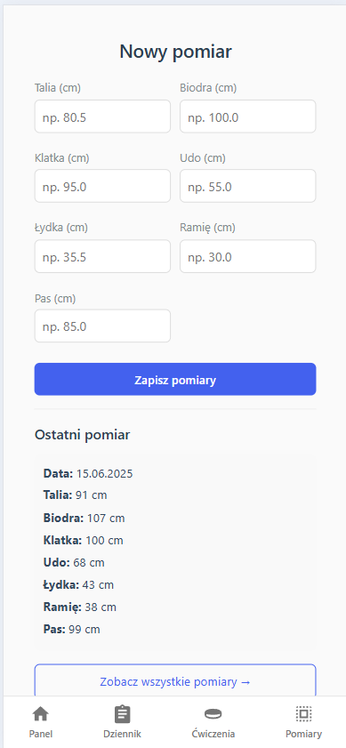
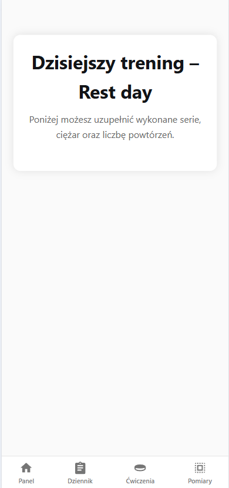

# Gym Dashboard App

This is a fitness web application built with Python and Flask.  
It helps users track:

- daily training logs
- physical measurements
- and exercise programs

---

## 📋 Features

- 📆 Calendar to log training/cardio/rest days
- 📈 Dashboard with weekly summary and diary insights
- 🏋️ Dynamic training view based on rotation (A, B, C, D)
- 📏 Measurements tracking with the ability to view latest and full history

---

## 🖼️ Preview

### Live - https://gym.mateuszoleksy.pl/

### Dashboard


### Calendar


### Measurements


### Rest Day View


---

## 🚀 Running the project

```bash
# install dependencies
pip install -r requirements.txt

# run the app
flask run
```

---

## 📁 Project Structure

- `/templates` – HTML views (Jinja2)
- `/static` – CSS/JS files
- `app.py` – main Flask application
- `config.py` – database config
- `models.py` - SQL structure
- `README.md` – this file

